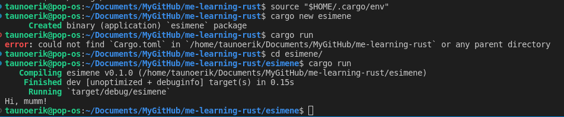

# Me Learning Rust

Installing Rust [rustup.rs](https://rustup.rs/)

## Tooling

**rustup** allows us to update and manage different versions of the **rustc** compiler. When a new version of Rust is released, we can update our compiler with the shell command `rustup update`.

**cargo** is Rust’s jack-of-all tools. It can help us manage external dependencies, run tests, configure compiler settings, and even install Rust binaries to our system. All of these features exist as subcommands to the cargo binary.

Subcommands:

- **new** - create packages

```Bash
# Create a new binary crate
cargo new my_binary
 
# Create a new library crate
cargo new --lib my_library
```

- **build** - compile

```Bash
# Build binary/library
cargo build
```

- **run** the binary

```Bash
# Run binary
cargo run
```

- **fmt** Rust has a convention for how code should be formatted. We can have cargo format our entire crate to meet these conventions with the cargo fmt command.

```Bash
# Format our `main.rs` file.
rustfmt src/main.rs
```

- **doc** Cargo has an automated system for generating HTML-based documentation for your crate with the `cargo doc` command. We can generate and open our crate’s documentation with `cargo doc --open`.

- **test** Rust has an entire system built into the language dedicated to tests. We can run the tests in our crate with the `cargo test` command.

cmd                   |comment
----------------------|---------------------------------------
cargo new             |Create a new binary executable crate
cargo new --lib       | Create a new library crate
cargo build           | Compiles our crate
cargo build --release | Compiles our crate with optimizations
cargo run             | Compiles our crate and runs the compiled executable
cargo test            | Run all tests in a crate
cargo doc --open      | Build and open our crate's documentation in a web browser
cargo clean           | Cleans up temporary files created during compilation
cargo publish         | Publishes your crate to `crates.io`
cargo install         | Installs a binary directly from crates.io

## Crate

 A project is called a package and packages can consist of one or multiple crates. If a package only has a single crate, it is often just called a “crate.”

```Bash
# New binary executable with the name "my_binary".
cargo new my_binary
```

This will create a folder named my_binary with the following directory structure:

├── src/
│  └── main.rs
└── Cargo.toml

_Cargo.toml_ serves as the configuration file for our crate.

```Bash
cd my_binary
cargo run
```



## Naming Conventions

The **UpperCamelCase** convention is reserved for types and traits:

```Rust
struct UnitStruct;
 
struct TupleStruct(T); // ... with generic type T
 
struct StructName {
  field: NamedTuple,
}
 
enum EnumName {
  VariantName,
}
 
type TypeAlias = u8;
 
trait TraitName {}
```

Items that follow the **snake_case** convention are reserved for attributes, variables, functions, and macros:

```Rust
// Attributes
#![attribute_name]
 
// Variables
let variable_name = true;
 
// Functions
fn function_name() {
    function_call();
}
 
// Macros
macro_name!();
macro_name![];
macro_name! {};
```

**SCREAMING_SNAKE_CAS**E names are reserved for constants:

```Rust
const EIGHTY_EIGHT: u32 = 88;
```

### Cargo.toml

The **[package]** table of our manifest file contains metadata about our crate. 

```Toml
[package]
name = "mybinary"  # The crate name
version = "0.1.0"  # The crate's current version
edition = "2021"   # Which "Rust Edition" the crate utilizes
 
description = ""   # A description of our crate for `crates.io`
keywords = ""      # Keywords for searches on `crates.io`
documentation = "" # URL to the crate's documentation
homepage = ""      # URL to the crate's homepage
repository = ""    # URL of the crate's source repository
authors = [""]     # The authors of the crate
license = ""       # The crate's license
rust-version = ""  # The minimum supported Rust version
```

We can utilize external libraries by declaring them as dependencies. To declare a dependency, we add the crate name and the desired version number under the **[dependencies]** table.

```Toml
[dependencies]
serde = "1.0.2"      # Uses version "1.0.2"
serde_derive = "1.0" # Uses version "1.0.X"
heck = "*"           # Uses version "X.X.X"
```

We can also pull dependencies directly from a git repository with the git field:

```Toml
serde = { git = "https://github.com/serde-rs/serde" }
 
# A specific branch
serde = { git = "https://github.com/serde-rs/serde", branch = "next" }
 
# A specific commit hash
serde = { git = "https://github.com/serde-rs/serde", rev = "7e19ae8c9486a3bbbe51f1befb05edee94c454f9" }
```
